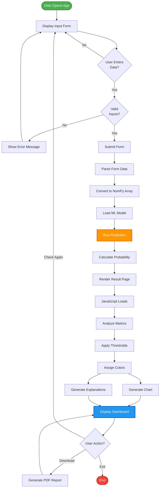

```mermaid
flowchart TD
    Start([User Opens App]) --> Form[Display Input Form]
    Form --> Input{User Enters<br/>Data?}
    Input -->|No| Form
    Input -->|Yes| Validate{Valid<br/>Inputs?}
    
    Validate -->|No| Error[Show Error Message]
    Error --> Form
    
    Validate -->|Yes| Submit[Submit Form]
    Submit --> Parse[Parse Form Data]
    Parse --> Convert[Convert to NumPy Array]
    Convert --> Load[Load ML Model]
    Load --> Predict[Run Prediction]
    Predict --> Prob[Calculate Probability]
    
    Prob --> Render[Render Result Page]
    Render --> JSLoad[JavaScript Loads]
    JSLoad --> Analyze[Analyze Metrics]
    Analyze --> Threshold[Apply Thresholds]
    Threshold --> Color[Assign Colors]
    Color --> Chart[Generate Chart]
    Color --> Explain[Generate Explanations]
    
    Chart --> Display[Display Dashboard]
    Explain --> Display
    
    Display --> Action{User Action?}
    Action -->|Check Again| Form
    Action -->|Download| PDF[Generate PDF Report]
    Action -->|Exit| End([End])
    
    PDF --> Display
    
    style Start fill:#4caf50,stroke:#2e7d32,stroke-width:2px,color:#fff
    style Predict fill:#ff9800,stroke:#e65100,stroke-width:2px,color:#fff
    style Display fill:#2196f3,stroke:#0d47a1,stroke-width:2px,color:#fff
    style End fill:#f44336,stroke:#b71c1c,stroke-width:2px,color:#fff
```
 
---
